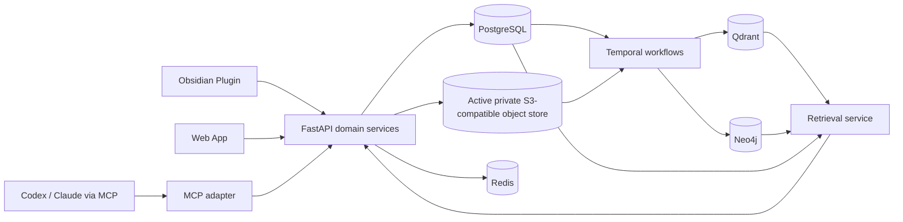

# Canonical Architecture

## 1. Source-of-truth hierarchy

```text
Canonical content bytes       Active private S3-compatible object store
Canonical application state   PostgreSQL
Editable clients              Obsidian + Web App
Search projection             Qdrant
Graph projection              Neo4j
Workflow history              Temporal
Ephemeral state               Redis
```

Active canonical object store và PostgreSQL tạo thành canonical boundary:

- Object store giữ immutable bytes được address bằng SHA-256.
- PostgreSQL giữ source identity, version order, current pointer, policy, ownership, audit và object reference.

Một object trong object store không tự nói nó thuộc source nào hoặc đang current. Một PostgreSQL row không có object hợp lệ cũng không tạo thành content version hoàn chỉnh.

Cloudflare R2 là backend production mặc định. MinIO Community được dùng cho local/test và có thể làm production fallback đã chấp nhận rủi ro. Mỗi deployment chỉ có một active backend được quyền ghi tại một thời điểm; không tự động failover giữa R2 và MinIO. Cutover phải chạy trong maintenance/read-only mode, replicate exact object keys, verify inventory/hash/size, đổi cấu hình có audit rồi chạy smoke test trước khi mở lại writes.

## 2. Data flow



## 3. Logical modules

- **Identity and authorization:** user, workspace, device, token, session và scope.
- **Source and version:** source bất kể loại, immutable versions, object references, conflicts và current pointer.
- **Sync:** manifest/events, policy, deduplication, upload/download và reconcile.
- **Ingestion:** parser theo source type, normalize, chunk, enrich và deterministic projection plan.
- **Retrieval:** semantic filter, dense/sparse/graph retrieval, fusion, rerank và diversity.
- **Context:** canonical text, token budget, prompt-injection defense và citations.
- **Graph:** explicit graph từ Markdown và inferred graph có provenance.
- **Actions:** proposal, policy check, diff, approval và client apply.
- **Administration:** exclusions, registry, providers, workflow, deployment và health.
- **Evaluation:** golden corpus, retrieval metrics, graph quality, feedback và regression gates.

## 4. Process topology

Giữ modular monolith với các process deploy độc lập:

```text
api       FastAPI HTTP and domain composition
mcp       MCP transport adapter
worker    Temporal activities and provider calls
web       Next.js workspace and admin UI
```

Các process dùng chung domain package và contracts. Không process nào lưu canonical file trên container disk.

## 5. Database responsibilities

| Thành phần | Sở hữu | Không được sở hữu |
|---|---|---|
| PostgreSQL | Identity, version, policy, workflow intent, audit, registry, route | Dense/sparse search chính |
| Active object store | Immutable source bytes và derived artifact lớn | Current pointer hoặc authorization |
| Qdrant | Chunk vectors và payload phục vụ retrieval | Canonical source |
| Neo4j | Rebuildable nodes/edges cho traversal | User, token, sync event |
| Temporal | Durable workflow execution/history | Business records dài hạn |
| Redis | Cache, rate limit, lock ngắn hạn, pub/sub | Dữ liệu duy nhất không thể tái tạo |

## 6. Consistency model

Canonical write hoàn tất khi object bytes đã được ghi và verify hash, PostgreSQL version row cùng current pointer đã commit nguyên tử, và một durable projection intent đã được ghi. Qdrant và Neo4j nhất quán eventual; API hiển thị projection status thay vì giả vờ dữ liệu searchable ngay lập tức.

## 7. Degradation strategy

- Redis lỗi: bỏ cache; correctness không đổi.
- Qdrant lỗi: retrieval trả structured unavailable; canonical reads vẫn hoạt động.
- Neo4j lỗi: chạy retrieval không graph expansion.
- Dense provider lỗi: retry; nếu policy cho phép thì dùng sparse-only query.
- Reranker lỗi: dùng fused order và đánh dấu degraded.
- Temporal lỗi: write intent vẫn nằm trong PostgreSQL và được dispatch lại.
- Canonical object bytes thiếu hoặc hash sai: fail closed, không lấy projection làm nguồn phục hồi.

## 8. Boundary rules

- API và MCP không chứa business logic đặc thù transport.
- MCP không query database trực tiếp khi có domain service.
- Parser có thể source-specific; chunking contract và projection layers source-neutral.
- Raw Qdrant filters, Cypher và SQL không được public client gửi vào.
- Provider exception được map thành typed application error.
- Mọi collection/graph generation gắn với contract hash và canonical checkpoint.
