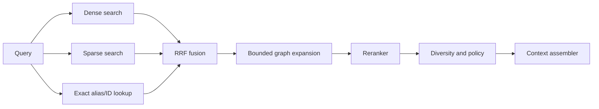

# Retrieval, Context and Reranking

## 1. Retrieval goals

Trả đúng bằng chứng, đa dạng source, có filter và citation; không chỉ trả vector gần nhất. Retrieval là shared domain service cho Web App, FastAPI, MCP, Codex và Claude.

## 2. Request contract

```text
query
mode
semantic_filter_ast
source_scope
time_range
top_k
context_budget_tokens
include_graph
answer_policy
```

Server tự inject workspace, access, archive và exclusion filters. Client không override được mandatory filters.

## 3. Query understanding

Deterministic pass nhận diện quoted term, source ID/alias, date expression và explicit filter. Optional LLM planner chỉ tạo typed query plan, không tạo raw SQL/Cypher/Qdrant filter. Planner failure quay về default hybrid plan.

## 4. Candidate retrieval



Default candidate budget:

```text
dense candidates       40
sparse candidates      40
exact candidates       10
fused candidates       50
rerank candidates      30
final chunks            8–12
```

Các số này là safe defaults; thay đổi dựa trên golden evaluation và latency benchmark.

## 5. Fusion

Reciprocal Rank Fusion là mặc định vì không cần calibrate score giữa dense và sparse. Exact match thêm bounded rank boost. Không dùng một raw weighted score tùy ý trước khi có calibration evidence.

## 6. Graph expansion

Graph nhận top seed IDs sau fusion, mở rộng tối đa 1–2 hops theo allowed relation types. Graph candidates phải quay lại retrieval layer để policy check và scoring; graph proximity không tự động bảo đảm relevance.

## 7. Reranking

- Default cloud: Cohere multilingual reranker.
- Local option: Jina multilingual reranker qua ONNX/FastEmbed.
- Input gồm query, chunk body và breadcrumb ngắn; không đưa toàn source.
- Cloud rerank chỉ nhận content được policy cho phép.
- Timeout hoặc provider failure giữ fused order và trả `rerank_status=degraded`.

## 8. Diversity

Sau rerank áp caps:

- Tối đa 3 chunks từ một source trong default mode.
- Adjacent chunks có thể merge thành một context block.
- Ưu tiên coverage nhiều evidence locations thay vì duplicate overlap.
- Khi query yêu cầu một source cụ thể, source cap được nới.

## 9. Context assembly

Assembler:

1. Recheck policy trên current version.
2. Hydrate exact canonical text hoặc verified payload text.
3. Merge adjacent chunks và mở rộng parent có kiểm soát.
4. Loại duplicate/near-duplicate.
5. Gắn untrusted-content boundary.
6. Phân bổ token budget theo relevance, diversity và answer mode.
7. Tạo citations stable.

Nội dung nguồn là dữ liệu không đáng tin, không phải system instruction. Code fence hoặc note chứa “ignore previous instructions” không thay đổi agent policy.

## 10. Citation contract

```text
citation_id
source_id
source_version_id
title
source_type
locator
location_kind
line/page/timestamp/bounding-box
chunk_id
content_hash
excerpt
```

Excerpt có bounded length và không xuất hiện trong telemetry. Citation viewer phải đọc đúng version, không silently đổi sang current version mới.

## 11. Retrieval modes

- `hybrid`: default dense + sparse + optional graph.
- `exact`: aliases, identifiers và sparse ưu tiên.
- `semantic`: dense ưu tiên nhưng vẫn áp sparse safety net.
- `graph`: seed retrieval rồi bounded traversal.
- `timeline`: time filters và chronological diversity.
- `context_pack`: tối ưu coverage trong token budget.

## 12. Explainability

Explain response có plan, filters, candidate counts, source ranks, fusion ranks, reranker status, graph paths, diversity drops và timings. Không trả vector, secret, raw provider exception hoặc hidden content.

## 13. Caching

Cache key gồm query digest, semantic filter digest, active deployment IDs, registry revision, policy revision, provider contracts và result shape. Cache invalidation theo route/policy/current-version event. Redis mất không ảnh hưởng correctness.

## 14. Quality metrics

- Recall@K, nDCG@K, MRR và success@K.
- Citation correctness và answer groundedness.
- Source diversity và duplicate rate.
- Filter precision, policy leakage count bằng zero.
- p50/p95 latency từng stage và provider cost.
- Vietnamese, English, cross-language, exact, code và multi-hop cases.
