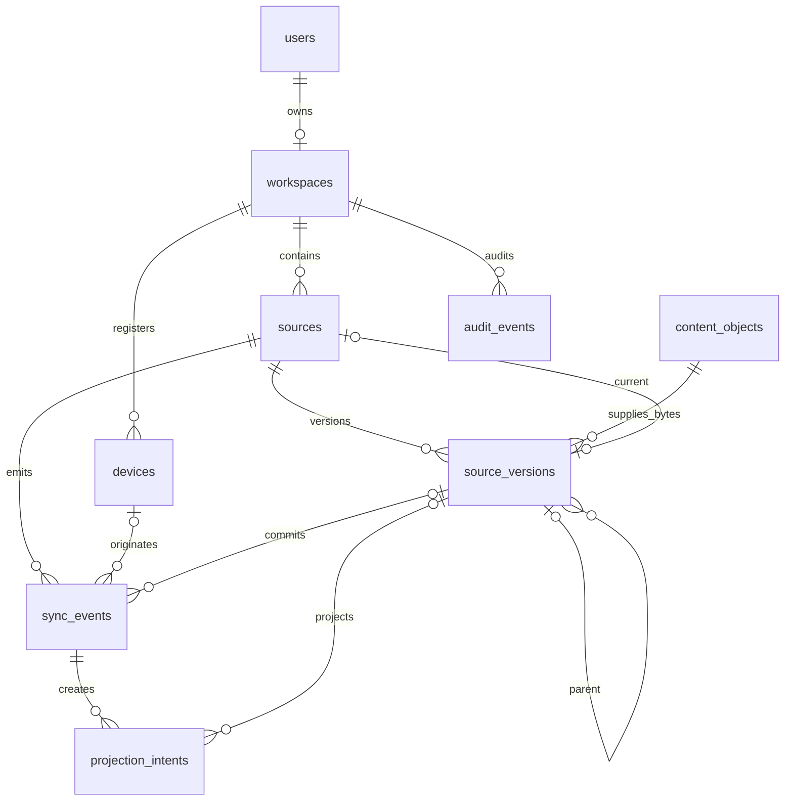

# Canonical PostgreSQL Baseline Design

**Status:** Approved design target for Phase 1 implementation planning

**Scope owner:** Canonical application database and Alembic migration baseline

**Depends on:** `phase-one-workspace-bootstrap-design.md`, `runtime-configuration-and-diagnostics-design.md`, `local-service-stack-design.md`

**Followed by:** `content-addressable-object-storage-design.md`, `source-version-commit-and-idempotency-design.md`

## 1. Objective

Create the first PostgreSQL application migration from an empty `knowledge` database. The baseline establishes only the relational correctness boundary required for:

- one user and one owned workspace;
- registered devices;
- stable source identity and immutable source versions;
- verified content-object references;
- idempotent source events;
- durable projection dispatch intents;
- append-only audit lineage.

The result is an empty, production-shaped schema. The migration does not bootstrap a user, workspace or device and does not implement the source-version transaction. Those behaviors belong to later Phase 1 specs.

PostgreSQL is the canonical authority for identity, ownership, source/version order, current pointers, events, projection intent and audit. Cloudflare R2 remains the only owner of canonical bytes. A row in this baseline never substitutes for an object that has not been uploaded and verified.

## 2. Scope

### 2.1 In scope

- Exact versions of Alembic, SQLAlchemy and Psycopg required to execute migrations.
- One Alembic branch and one baseline revision.
- Application schema ownership and migration connection contract.
- Nine baseline tables:
  - `users`
  - `workspaces`
  - `devices`
  - `content_objects`
  - `sources`
  - `source_versions`
  - `sync_events`
  - `projection_intents`
  - `audit_events`
- Primary keys, foreign keys, tenant-containment constraints, checks, unique constraints and query-critical indexes.
- Database-enforced immutability for source versions, content objects and sync events.
- Database-enforced append-only audit rows.
- Empty upgrade, populated constraint tests, destructive-gated downgrade and second-upgrade verification on disposable PostgreSQL 18.4.
- Migration diagnostics that never expose credentials, connection URLs, SQL parameters or vendor exception text.

### 2.2 Out of scope

- User credentials, device tokens, web sessions, API/MCP tokens or authorization scopes.
- Source locators, tombstones, conflicts, device cursors, manifests and multipart uploads.
- Metadata registry, source policy, proposals, approvals, query logs and provider usage.
- Projection deployments, routes, checkpoints, manifests, failures and embedding cache.
- SQLAlchemy ORM models, repositories, Unit of Work or application CRUD services.
- User/workspace/device bootstrap behavior.
- R2 upload, object verification, deduplication service or garbage collection.
- Source-version publish transaction, optimistic concurrency and idempotent replay behavior.
- Temporal workflows, Qdrant collections or Neo4j schema.
- Row-level security. The initial deployment has one application role and one logical workspace; authorization remains an application-service responsibility.
- Seed data, demo data and application tables outside the nine named tables.

## 3. Selected approach

Use a handwritten Alembic baseline targeting PostgreSQL 18.4. The migration creates a dedicated `knowledge` schema and fully qualifies every application object. Alembic's own version table remains `public.alembic_version`, outside the application schema, so `downgrade base` can remove the complete application schema without invalidating Alembic bookkeeping.

Use PostgreSQL-native `uuid`, `timestamptz`, `bigint`, `jsonb` only where explicitly approved, and `text`/bounded `varchar` with named `CHECK` constraints for closed lifecycle values. Do not create PostgreSQL enum types. Adding an allowed value is then a normal reviewed constraint migration instead of an enum-type operation with asymmetric rollback behavior.

Identifiers are generated outside PostgreSQL and supplied explicitly. The baseline does not set `uuidv7()` or `gen_random_uuid()` defaults. The backend is the identity authority for `user_id`, `workspace_id`, `device_id`, `source_id`, `source_version_id`, `content_object_id`, `projection_intent_id` and `audit_event_id`. An Obsidian plugin may generate `event_id` before connectivity so an offline queued operation keeps the same identity across retry. Web and backend operations generate their event IDs at the server boundary. Server-owned request IDs continue to use UUIDv7 at the operation boundary defined by the diagnostics spec.

Composite foreign keys include `workspace_id` even though entity IDs are globally unique UUIDs. This makes accidental cross-workspace references impossible at the database boundary and preserves the intended tenant boundary if the one-workspace product constraint changes later. `content_objects` is the deliberate exception: it is global metadata for globally deduplicated CAS bytes, while each referencing `source_version` remains workspace-contained through its source.

### 3.1 Obsidian SQLite boundary

The Obsidian plugin uses SQLite only as a local synchronization journal. SQLite may retain the backend-issued `device_id`, local-file-to-`source_id` mappings, base version, content hash, pending `event_id`/idempotency keys and the last applied server event sequence. SQLite row identifiers and local filesystem paths never become PostgreSQL identities.

The backend issues one canonical `source_id`; every device that observes the same registered note receives that same ID through manifest reconciliation. Different devices keep different backend-issued `device_id` values and produce different event IDs for their operations. Losing the local SQLite database causes reconciliation, not creation of a second canonical source by assumption. Locator matching, simultaneous first registration and server device cursors belong to the Obsidian sync spec.

Content changes are admitted at an explicit save or bounded plugin debounce boundary. Individual keystrokes, health checks, polling and cursor reads do not create source versions.

### 3.2 Alternatives rejected

1. **One table per future domain from `07-POSTGRESQL_DATA_MODEL.md`.** This would front-load policy, metadata, projection routing and safety contracts whose owning specs have not been designed.
2. **A generic `entities` or `events` JSONB table.** Stable foreign keys, version order, current pointers and dispatch state are query-critical relational state and must not be hidden in JSONB.
3. **PostgreSQL enum types.** They are compact but make ordinary vocabulary evolution and downgrade more operationally complex than named checks for this baseline.
4. **Database-generated IDs.** Device/offline event producers need stable identities before the database transaction begins.
5. **A mutable `content_objects.reference_count` counter.** It can drift from immutable version references. The authoritative reference count is derived from `source_versions` under the later garbage-collection transaction.
6. **Cascade deletion.** Canonical lineage must not disappear because a parent row was deleted. All baseline foreign keys use `RESTRICT`/`NO ACTION`; lifecycle changes use status/tombstone behavior in their owning specs.
7. **Autogenerate as the baseline authority.** Alembic autogenerate may assist future reviewed diffs, but it is not a substitute for explicit constraint, index, trigger and downgrade design.

## 4. Tooling and repository artifacts

### 4.1 Approved migration dependencies

Pin these stable releases in the root lockfile:

| Package | Version | Role |
|---|---:|---|
| `alembic` | `1.18.5` | Migration runner and revision graph |
| `SQLAlchemy` | `2.0.51` | Alembic engine and PostgreSQL DDL types |
| `psycopg[binary]` | `3.3.4` | PostgreSQL 18 synchronous migration driver |

SQLAlchemy and Psycopg are migration infrastructure dependencies. No module under `src/personal_os/` imports them in this spec, preserving the existing domain/import boundary. A later persistence-adapter spec must deliberately revise that boundary before application repositories are added.

### 4.2 Required artifacts

```text
alembic.ini
migrations/
├── env.py
├── script.py.mako
└── versions/
    └── <revision>_create_canonical_postgresql_baseline.py
tests/
├── contract/
│   └── test_canonical_postgresql_migration_contract.py
└── integration/
    └── test_canonical_postgresql_baseline.py
```

The revision filename uses a real Alembic revision identifier plus the semantic slug `create_canonical_postgresql_baseline`. It must not use `initial`, `phase1`, `task4`, `final` or another order-only/misleading name.

### 4.3 Alembic branch contract

- The baseline has `down_revision = None`.
- The repository has exactly one Alembic head.
- Revision labels and branch labels are absent unless a later reviewed branch design requires them.
- `upgrade()` and `downgrade()` contain explicit operations; neither calls application services or imports application/domain models.
- The revision is deterministic and performs no network operation other than the active PostgreSQL connection.
- No migration reads R2, Qdrant, Neo4j, Redis or Temporal.
- No migration creates data rows.
- Migration code contains no environment-specific hostname, password, secret path or full connection URL.

## 5. Migration connection and execution boundary

### 5.1 Typed migration settings

The Alembic environment owns a frozen `DatabaseMigrationSettings` snapshot. It composes the existing secret-file safety rules but is not added to the shared `RuntimeSettings`, which deliberately remains database-neutral.

Accepted settings are exactly:

```text
KNOWLEDGE_ENVIRONMENT
KNOWLEDGE_SECRET_ROOT
KNOWLEDGE_DATABASE_HOST
KNOWLEDGE_DATABASE_PORT
KNOWLEDGE_DATABASE_NAME
KNOWLEDGE_DATABASE_USER
KNOWLEDGE_DATABASE_PASSWORD_FILE
KNOWLEDGE_DATABASE_SSL_MODE
```

Defaults for local execution are:

```text
host                 127.0.0.1
port                 5432
database             knowledge
user                 knowledge_app
password file        postgres_application_password
ssl mode             disable only when environment=local or test
```

`KNOWLEDGE_DATABASE_PASSWORD_FILE` is a single relative filename resolved beneath the absolute `KNOWLEDGE_SECRET_ROOT`. It cannot contain a separator, `.` or `..`. The password is read with the bounded, regular-file, resolved-path and permission contract from `runtime-configuration-and-diagnostics-design.md`.

Staging and production require `sslmode=verify-full`; the owning deployment spec later adds the CA file contract. `disable`, `allow` and `prefer` are rejected outside local/test. A plaintext password, `DATABASE_URL`, `.env`, CLI password argument and committed URL are unsupported.

`alembic.ini` has no `sqlalchemy.url`. `migrations/env.py` creates a SQLAlchemy `URL` object in memory, uses `NullPool`, and never renders it to diagnostics. Connection configuration sets:

```text
connect_timeout                         5 seconds
lock_timeout                            5 seconds
statement_timeout                      60 seconds
idle_in_transaction_session_timeout   60 seconds
application_name                       knowledge-migration
timezone                               UTC
```

Migrations do not retry. The operator or CI job owns retry after classifying a typed prerequisite, authentication, timeout or schema-contract failure.

### 5.2 Execution commands

Supported commands are:

```text
uv run alembic current --check-heads
uv run alembic heads
uv run alembic upgrade head
uv run alembic -x allow_destructive=true downgrade base
```

Any downgrade from the baseline is destructive because it removes all nine tables. `migrations/env.py` rejects a downgrade unless `-x allow_destructive=true` is present exactly. Production procedure additionally requires a verified backup and compatible application rollback; the CLI flag is necessary but not sufficient operational authorization.

### 5.3 Transaction behavior

- PostgreSQL transactional DDL is enabled.
- The baseline runs in one migration transaction.
- A failed create/check/index/trigger operation rolls back the entire baseline.
- `transaction_per_migration=true` is explicit in Alembic configuration.
- The migration acquires a PostgreSQL advisory transaction lock derived from the fixed token `knowledge-schema-migration` so two migration runners cannot modify the revision graph concurrently.
- The lock wait is bounded by `lock_timeout`.
- An already-at-head `upgrade head` is a no-op and returns success.
- The baseline fails closed if the `knowledge` schema or a conflicting object already exists outside Alembic ownership; it does not adopt, rename or drop unknown state.

## 6. Schema-wide conventions

### 6.1 Schema, ownership and qualification

- Application objects live in schema `knowledge`.
- The migration connects as `knowledge_app`, which owns the `knowledge` database in the local-service contract.
- The migration creates `knowledge AUTHORIZATION knowledge_app`.
- Every DDL and SQL reference is schema-qualified.
- The runtime/migration search path is not used as a correctness mechanism.
- `PUBLIC` receives no `CREATE` or object privileges on `knowledge`.
- No extension is installed by the baseline.

### 6.2 Identifier and timestamp rules

- Every entity/event/intent primary key is PostgreSQL `uuid`, supplied explicitly and `NOT NULL`.
- `event_sequence` alone uses `bigint GENERATED ALWAYS AS IDENTITY`; it is ordering metadata, not business identity and is not gapless.
- All timestamps use `timestamp with time zone` and are interpreted in UTC.
- Server-owned creation/commit timestamps use `DEFAULT CURRENT_TIMESTAMP`.
- Client timestamps never determine version conflict winners or canonical order.
- Mutable roots (`users`, `workspaces`, `devices`, `sources`, `projection_intents`) have `updated_at >= created_at` checks. The application must set `updated_at`; no hidden auto-update trigger is created.

### 6.3 Text and lifecycle vocabulary

- Closed vocabularies use lowercase ASCII `text` plus named `CHECK` constraints.
- User-facing labels are bounded `varchar`, trimmed and non-empty.
- Machine keys use lowercase ASCII slug checks.
- SHA-256 values are exactly 64 lowercase hexadecimal characters.
- Result/reason/action fields contain bounded safe tokens, never content or exception messages.
- The baseline stores no source body, query, vector, token, password, object-store credential or provider response.

### 6.4 Constraint and index naming

All names are explicit and semantic:

```text
pk_<table>
fk_<table>__<role>
uq_<table>__<business_key>
ck_<table>__<invariant>
ix_<table>__<query_role>
trg_<table>__<behavior>
```

Names must remain within PostgreSQL's 63-byte identifier limit without relying on silent truncation. Foreign-key referencing columns receive an explicit index unless an existing unique index has the same useful leading columns.

## 7. Relationship model



The exceptions to the general “every business table carries `workspace_id`” rule are `users`, which exists above a workspace; `workspaces`, which is the workspace root; and globally deduplicated `content_objects`. Every source/version/event/intent/audit row remains workspace-contained.

## 8. Exact table contracts

### 8.1 `knowledge.users`

| Column | Type | Null/default | Meaning |
|---|---|---|---|
| `user_id` | `uuid` | not null, no default | Stable user identity |
| `username` | `varchar(64)` | not null | Normalized local identity key; not an email |
| `display_name` | `varchar(200)` | not null | User-controlled display label |
| `status` | `text` | not null, `active` | `active` or `disabled` |
| `created_at` | `timestamptz` | not null, current timestamp | Creation time |
| `updated_at` | `timestamptz` | not null, current timestamp | Last canonical update |

Constraints:

- Primary key `user_id`.
- Unique `username`.
- `username` matches `^[a-z0-9][a-z0-9._-]{0,63}$`.
- `display_name = btrim(display_name)` and length is `1..200`.
- `status IN ('active', 'disabled')`.
- `updated_at >= created_at`.

The baseline does not store email, password hash, identity-provider subject, recovery data or session state.

### 8.2 `knowledge.workspaces`

| Column | Type | Null/default | Meaning |
|---|---|---|---|
| `workspace_id` | `uuid` | not null, no default | Stable workspace identity |
| `owner_user_id` | `uuid` | not null | Owning user |
| `workspace_key` | `varchar(64)` | not null | Stable normalized operator key |
| `display_name` | `varchar(200)` | not null | User-facing workspace name |
| `status` | `text` | not null, `active` | `active` or `archived` |
| `created_at` | `timestamptz` | not null, current timestamp | Creation time |
| `updated_at` | `timestamptz` | not null, current timestamp | Last canonical update |

Constraints:

- Primary key `workspace_id`.
- Foreign key `owner_user_id -> users.user_id ON DELETE RESTRICT`.
- Unique `owner_user_id`, enforcing at most one workspace for each user in the initial product.
- Unique `workspace_key`.
- Unique `(workspace_id, owner_user_id)` for tenant-contained device ownership.
- `workspace_key` uses the same lowercase slug grammar as `username`.
- Trimmed non-empty `display_name`, closed `status`, and monotonic timestamps.

The database does not enforce “at most one row in users” with a singleton sentinel. Deployment/bootstrap policy creates one user; the ownership constraint prevents that user from owning multiple workspaces without creating an artificial migration barrier for future identity expansion.

### 8.3 `knowledge.devices`

| Column | Type | Null/default | Meaning |
|---|---|---|---|
| `device_id` | `uuid` | not null, no default | Stable device identity |
| `workspace_id` | `uuid` | not null | Owning workspace |
| `user_id` | `uuid` | not null | Workspace owner who registered it |
| `device_name` | `varchar(200)` | not null | Operator-visible label |
| `device_kind` | `text` | not null | `obsidian`, `web` or `system` |
| `status` | `text` | not null, `active` | `active` or `revoked` |
| `registered_at` | `timestamptz` | not null, current timestamp | Registration time |
| `last_seen_at` | `timestamptz` | null | Last authenticated activity |
| `revoked_at` | `timestamptz` | null | Revocation time |

Constraints:

- Primary key `device_id` and unique `(workspace_id, device_id)`.
- Composite foreign key `(workspace_id, user_id) -> workspaces(workspace_id, owner_user_id) ON DELETE RESTRICT`.
- Trimmed non-empty `device_name`.
- Closed device kind and status checks.
- `last_seen_at IS NULL OR last_seen_at >= registered_at`.
- `(status = 'revoked') = (revoked_at IS NOT NULL)` and `revoked_at >= registered_at` when present.

Index `(workspace_id, status, registered_at, device_id)` supports active-device administration. Revocation preserves the row; physical device deletion is not a supported product action.

### 8.4 `knowledge.content_objects`

| Column | Type | Null/default | Meaning |
|---|---|---|---|
| `content_object_id` | `uuid` | not null, no default | Stable metadata-row identity |
| `content_hash` | `varchar(64)` | not null | SHA-256 of exact bytes |
| `object_key` | `varchar(128)` | not null | Exact content-addressed R2 key |
| `byte_size` | `bigint` | not null | Exact verified object size |
| `media_type` | `varchar(255)` | not null | Normalized MIME type without parameters |
| `verified_at` | `timestamptz` | not null | Time exact key/hash/size verification completed |
| `created_at` | `timestamptz` | not null, current timestamp | Time verified metadata was recorded |

Constraints:

- Primary key `content_object_id`.
- Global unique `content_hash` and global unique `object_key`, matching the single-workspace/single-private-bucket contract.
- `content_hash ~ '^[0-9a-f]{64}$'`.
- `object_key` equals `objects/sha256/{first_2}/{next_2}/{content_hash}`, derived from the same row's hash.
- `byte_size >= 0`.
- `media_type` is lowercase, trimmed, contains exactly one `/`, and matches the bounded MIME-token grammar; parameters such as `; charset=utf-8` are rejected.
- `verified_at <= created_at`.

Only verified objects are inserted. There is no `pending`, `uploading` or `verification_failed` row state. Upload/session state belongs to the object-storage spec. Reference count is derived by counting `source_versions.content_object_id`; no mutable counter is stored.

`UPDATE` is rejected by an immutability trigger. The baseline exposes no content-object deletion behavior; foreign keys prevent deletion while a source version references the row.

### 8.5 `knowledge.sources`

| Column | Type | Null/default | Meaning |
|---|---|---|---|
| `source_id` | `uuid` | not null, no default | Stable identity across rename/move |
| `workspace_id` | `uuid` | not null | Owning workspace |
| `source_type` | `text` | not null | Initial supported source type |
| `title` | `varchar(500)` | not null | Current user-facing title |
| `sync_state` | `text` | not null, `pending` | Canonical source lifecycle |
| `current_version_id` | `uuid` | null | Authoritative current-version pointer |
| `created_at` | `timestamptz` | not null, current timestamp | Identity creation time |
| `updated_at` | `timestamptz` | not null, current timestamp | Last canonical update |
| `deleted_at` | `timestamptz` | null | Logical deletion time |

Constraints:

- Primary key `source_id` and unique `(workspace_id, source_id)`.
- Foreign key `workspace_id -> workspaces.workspace_id ON DELETE RESTRICT`.
- `source_type IN ('markdown', 'text', 'pdf', 'image', 'audio', 'web', 'youtube')`.
- Trimmed title with length `1..500`.
- `sync_state IN ('pending', 'active', 'stored_not_indexed', 'deleted')`.
- `pending` requires `current_version_id IS NULL`; every other state requires a current version.
- `(sync_state = 'deleted') = (deleted_at IS NOT NULL)`.
- `deleted_at IS NULL OR deleted_at >= created_at`; `updated_at >= created_at`.

After `source_versions` exists, the migration adds a composite foreign key `(workspace_id, source_id, current_version_id) -> source_versions(workspace_id, source_id, source_version_id)`. It is `DEFERRABLE INITIALLY IMMEDIATE`, uses PostgreSQL's default `MATCH SIMPLE`, and deletes are restricted. A null current pointer is therefore allowed for a pending source; a non-null pointer must identify a version of that exact source and workspace. The later publish transaction may explicitly defer the constraint but must leave it valid at commit.

Index `(workspace_id, sync_state, updated_at, source_id)` supports workspace listing and repair scans. Locator/path/URL are deliberately absent until the source-locator spec defines history and rename/move semantics.

### 8.6 `knowledge.source_versions`

| Column | Type | Null/default | Meaning |
|---|---|---|---|
| `source_version_id` | `uuid` | not null, no default | Immutable version identity |
| `workspace_id` | `uuid` | not null | Owning workspace inherited from the source |
| `source_id` | `uuid` | not null | Versioned source |
| `content_object_id` | `uuid` | not null | Verified canonical object metadata |
| `content_version` | `bigint` | not null | Monotonic per-source ordinal |
| `parent_version_id` | `uuid` | null | Previous/base version lineage |
| `author_kind` | `text` | not null | `user`, `device`, `system` or `approved_action` |
| `author_id` | `uuid` | null | Actor identity interpreted by `author_kind` |
| `client_timestamp` | `timestamptz` | null | Informational client time |
| `committed_at` | `timestamptz` | not null, current timestamp | Canonical transaction time |

Constraints:

- Primary key `source_version_id`.
- Unique `(workspace_id, source_id, source_version_id)` for current/parent containment.
- Unique `(workspace_id, source_id, content_version)`; `content_version >= 1`.
- Composite foreign key `(workspace_id, source_id) -> sources(workspace_id, source_id) ON DELETE RESTRICT`.
- Foreign key `content_object_id -> content_objects.content_object_id ON DELETE RESTRICT`. Content objects are globally deduplicated canonical-byte metadata, not owned duplicates per workspace.
- Composite self foreign key `(workspace_id, source_id, parent_version_id) -> source_versions(workspace_id, source_id, source_version_id) ON DELETE RESTRICT` using default `MATCH SIMPLE`, so the first version may have a null parent.
- `parent_version_id IS NULL OR parent_version_id <> source_version_id`.
- Closed author-kind check; `system` requires `author_id IS NULL`, all other kinds require it.
- `client_timestamp` is not constrained relative to server time because offline clients can have clock skew.

The database can enforce unique ordinals but cannot prove “next ordinal equals current + 1” or parent ordinal ordering with a row-local `CHECK`. The later publish service locks the source row, verifies the expected base, computes the next ordinal and commits version/current pointer/event/intents atomically.

`UPDATE` is rejected. The baseline exposes no source-version deletion behavior; current-pointer, child-version, event and projection-intent references preserve existing lineage.

### 8.7 `knowledge.sync_events`

| Column | Type | Null/default | Meaning |
|---|---|---|---|
| `event_id` | `uuid` | not null, no default | Stable client/business event ID |
| `workspace_id` | `uuid` | not null | Owning workspace |
| `event_sequence` | `bigint identity` | generated always | Server ordering cursor; gaps allowed |
| `source_id` | `uuid` | not null | Affected source |
| `device_id` | `uuid` | null | Originating device when applicable |
| `committed_version_id` | `uuid` | null | Committed version outcome when applicable |
| `base_version_id` | `uuid` | null | Client's expected base when applicable |
| `idempotency_key` | `varchar(200)` | not null | Workspace-scoped replay key |
| `request_fingerprint` | `varchar(64)` | not null | SHA-256 of canonical request envelope |
| `event_type` | `text` | not null | `create`, `update`, `rename`, `move`, `delete` or `restore` |
| `client_timestamp` | `timestamptz` | null | Informational client time |
| `committed_at` | `timestamptz` | not null, current timestamp | Canonical event commit time |

Constraints:

- Primary key `event_id`; unique `(workspace_id, event_id)`.
- Unique `event_sequence` and unique `(workspace_id, idempotency_key)`.
- Composite source, device, committed-version and base-version foreign keys all include `workspace_id`; version foreign keys also include `source_id`.
- Device is nullable for Web/system operations.
- `idempotency_key` is trimmed ASCII, length `1..200`, and contains no whitespace/control character.
- `request_fingerprint` is lowercase SHA-256.
- Closed event-type check.

Index `(workspace_id, source_id, event_sequence)` supports source history; unique `(workspace_id, idempotency_key)` supports replay lookup. The sequence orders committed events but does not replace `event_id`, per-device cursors or source-version ordinals.

The baseline intentionally does not impose event-type-specific nullability rules for version/base fields. The later source-commit spec owns the exact create/update/rename/move/delete/restore state machine. `UPDATE` is rejected, and this baseline exposes no event-deletion behavior.

### 8.8 `knowledge.projection_intents`

| Column | Type | Null/default | Meaning |
|---|---|---|---|
| `projection_intent_id` | `uuid` | not null, no default | Durable dispatch identity |
| `workspace_id` | `uuid` | not null | Owning workspace |
| `event_id` | `uuid` | not null | Canonical event that created the intent |
| `source_id` | `uuid` | not null | Projection subject |
| `source_version_id` | `uuid` | null | Version to project, when applicable |
| `projection_kind` | `text` | not null | `qdrant` or `neo4j` |
| `operation` | `text` | not null | `upsert` or `delete` |
| `status` | `text` | not null, `pending` | `pending`, `leased`, `dispatched` or `terminal` |
| `attempt_count` | `integer` | not null, `0` | Completed dispatch attempts |
| `available_at` | `timestamptz` | not null, current timestamp | Earliest next claim time |
| `lease_token` | `uuid` | null | Current dispatcher fence |
| `leased_until` | `timestamptz` | null | Claim expiry |
| `dispatched_at` | `timestamptz` | null | Temporal dispatch acknowledgement |
| `last_error_code` | `varchar(100)` | null | Registered safe error code only |
| `created_at` | `timestamptz` | not null, current timestamp | Intent creation time |
| `updated_at` | `timestamptz` | not null, current timestamp | Last state transition |

Constraints:

- Primary key `projection_intent_id` and unique `(workspace_id, projection_intent_id)`.
- Composite foreign keys bind event, source and optional version to the same workspace/source.
- Unique `(workspace_id, event_id, projection_kind)` prevents duplicate per-projection intents on event replay.
- Closed projection-kind, operation and status checks.
- `attempt_count >= 0`, `available_at >= created_at`, `updated_at >= created_at`.
- `upsert` requires `source_version_id`; `delete` may retain a version for cleanup provenance.
- `leased` requires both `lease_token` and `leased_until`, with `leased_until > updated_at`; all other statuses require both lease fields null.
- `dispatched` requires `dispatched_at`; all other statuses require it null.
- `terminal` requires `last_error_code`; other states may retain a safe prior error code for retry diagnostics.
- `last_error_code`, when present, matches `^[a-z][a-z0-9_]{0,99}$`.

A partial dispatch index on `(available_at, created_at, projection_intent_id)` where `status = 'pending'` supports `FOR UPDATE SKIP LOCKED` batches. Index `(workspace_id, source_id, created_at, projection_intent_id)` supports source status. The dispatcher must claim in a transaction, use the lease token as a fencing value and return an expired lease to `pending`; that behavior belongs to the source-version/idempotency spec.

The intent records durable dispatch, not projection completion. Qdrant/Neo4j success, checkpoint and active route state belong to later projection tables.

### 8.9 `knowledge.audit_events`

| Column | Type | Null/default | Meaning |
|---|---|---|---|
| `audit_event_id` | `uuid` | not null, no default | Stable audit identity |
| `workspace_id` | `uuid` | not null | Owning workspace |
| `actor_kind` | `text` | not null | `user`, `device`, `system` or `workflow` |
| `actor_id` | `uuid` | null | User/device identity when applicable |
| `actor_reference` | `varchar(128)` | null | Safe workflow reference when applicable |
| `action` | `varchar(100)` | not null | Registered action token |
| `target_kind` | `varchar(100)` | not null | Registered target token |
| `target_id` | `uuid` | null | Target identity when one exists |
| `request_id` | `uuid` | not null | Server-owned operation UUIDv7 |
| `client_request_id` | `uuid` | null | Validated client correlation ID |
| `trace_id` | `varchar(32)` | null | W3C trace ID in lowercase hex |
| `result` | `text` | not null | `succeeded`, `rejected` or `failed` |
| `reason_code` | `varchar(100)` | null | Registered safe reason token |
| `safe_diff_hash` | `varchar(64)` | null | SHA-256 of approved safe diff representation |
| `occurred_at` | `timestamptz` | not null, current timestamp | Canonical audit time |

Constraints:

- Primary key `audit_event_id`; foreign key to workspace with delete restricted.
- `actor_kind IN ('user', 'device', 'system', 'workflow')`.
- `user`/`device` require `actor_id` and no `actor_reference`; `system` requires neither; `workflow` requires `actor_reference` and no `actor_id`.
- `actor_reference`, `action`, `target_kind` and `reason_code` use bounded safe-token grammar `^[a-z][a-z0-9_.:-]*$` with their declared maximum lengths.
- `trace_id`, when present, is exactly 32 lowercase hexadecimal characters and is not all zeroes.
- Closed result check.
- `safe_diff_hash`, when present, is lowercase SHA-256.

Index `(workspace_id, occurred_at DESC, audit_event_id)` supports chronological audit review. A partial index `(workspace_id, target_kind, target_id, occurred_at DESC)` where `target_id IS NOT NULL` supports target lineage. Index `(workspace_id, request_id)` supports operation correlation.

Audit stores no generic JSONB payload or free-form message in the baseline. It cannot hold raw content, title/path, query, prompt, credential, exception text or arbitrary before/after data. A later audit schema revision may add a bounded typed detail contract only with leakage tests.

A `BEFORE UPDATE OR DELETE` trigger always raises SQLSTATE `55000` with the fixed database message `audit_events_append_only`. Only migration downgrade may remove the trigger and table.

## 9. Immutability functions and triggers

The baseline creates two schema-qualified trigger functions owned by `knowledge_app`:

```text
knowledge.reject_immutable_update()
knowledge.reject_audit_mutation()
```

`reject_immutable_update()` is attached `BEFORE UPDATE` to:

- `content_objects`
- `source_versions`
- `sync_events`

It raises SQLSTATE `55000` with fixed message `immutable_row_update_rejected`. It does not interpolate table name, key or row data into the error.

`reject_audit_mutation()` is attached `BEFORE UPDATE OR DELETE` to `audit_events` and raises the fixed audit message. Trigger functions have an explicit safe `search_path` and reference no caller-controlled identifier dynamically.

The triggers protect against accidental mutation through application repositories. They do not claim to defend against the database owner deliberately altering DDL; deployment controls and audit/backup procedures own that threat.

## 10. Migration ordering

### 10.1 Upgrade

The baseline upgrades in this exact dependency order:

1. Acquire the advisory transaction lock.
2. Verify PostgreSQL server major version is exactly `18` and current database is the configured application database.
3. Create schema `knowledge` with exact owner and revoke `PUBLIC` privileges.
4. Create `users`.
5. Create `workspaces`.
6. Create `devices`.
7. Create `content_objects`.
8. Create `sources` without its circular current-version foreign key.
9. Create `source_versions` and its self-parent foreign key.
10. Add `sources.current_version_id` composite foreign key.
11. Create `sync_events`.
12. Create `projection_intents`.
13. Create `audit_events`.
14. Create explicit secondary/partial indexes.
15. Create immutability functions and triggers.
16. Verify the revision transaction can see every expected object before returning.

The migration supports PostgreSQL 18.x only. A different server major is a prerequisite failure, not a cue to emit different DDL.

### 10.2 Downgrade

After the destructive gate is satisfied, downgrade executes the exact reverse dependency order without `DROP ... CASCADE`:

1. Drop audit and immutability triggers.
2. Drop trigger functions.
3. Drop `audit_events`.
4. Drop `projection_intents`.
5. Drop `sync_events`.
6. Drop the circular `sources.current_version_id` foreign key.
7. Drop `source_versions`.
8. Drop `sources`.
9. Drop `content_objects`.
10. Drop `devices`.
11. Drop `workspaces`.
12. Drop `users`.
13. Revoke remaining grants and drop the now-empty `knowledge` schema with `RESTRICT`.

`public.alembic_version` may remain as an empty Alembic infrastructure table. No `knowledge` schema, table, sequence, index, function or trigger may remain. If an unexpected dependent object prevents `RESTRICT`, downgrade fails and rolls back instead of deleting it.

## 11. Failure behavior

- Missing/unsupported PostgreSQL, invalid migration settings or unavailable secret file fails before DDL.
- Authentication, TLS and connection failures map to registered typed errors without raw driver text.
- PostgreSQL major-version mismatch is terminal.
- More than one Alembic head is a contract failure.
- A schema revision ahead of the application is terminal; the application must not start against it.
- A revision behind head is a readiness/configuration failure until `upgrade head` succeeds.
- A dirty/unmanaged `knowledge` schema is terminal; no adoption or cleanup is automatic.
- Concurrent migration loses or times out on the advisory lock and returns a retryable migration-busy result without partial DDL.
- Constraint/index/trigger creation failure rolls back the baseline transaction.
- Reusing an idempotency key with another request fingerprint is not resolved by this migration; the later commit service detects and rejects it.
- A duplicate version ordinal or cross-workspace/source pointer is rejected by PostgreSQL.
- Downgrade without the exact destructive gate is refused before any drop.
- Downgrade blocked by an unknown dependent object rolls back; `CASCADE`, schema wipe and database recreation are never attempted automatically.
- Migration output never contains the password, secret root/file, DSN, connection URL, SQL parameter values or raw source/audit data.

## 12. Test strategy

### 12.1 Static migration contracts

Contract tests parse repository artifacts and require:

- one revision, one head and `down_revision = None`;
- all nine exact table names and no extra application table;
- fully qualified `knowledge` objects;
- explicit upgrade and downgrade functions;
- no `CASCADE`, seed insert, `.env`, `DATABASE_URL`, R2/provider import or application-model import;
- named constraints/indexes/triggers that fit the identifier limit;
- no PostgreSQL enum type or extension creation;
- no floating/unpinned migration dependencies;
- the destructive downgrade gate exists;
- all configured error messages are fixed safe tokens.

Static string tests supplement but do not replace the live catalog assertions.

### 12.2 Disposable PostgreSQL integration lifecycle

Run against PostgreSQL `18.4` in a unique `knowledge-ci-<token>` local-stack project. The test must never target an operator's `knowledge-local` project or a non-disposable database.

The lifecycle is:

1. Start the disposable stack and confirm the application database contains no application schema.
2. Run `alembic upgrade head`.
3. Run `alembic current --check-heads`.
4. Inspect `pg_catalog`/`information_schema` for exact tables, columns, defaults, constraints, indexes, identity, functions, triggers, owners and privileges.
5. Insert a valid user/workspace/device/object/source/version/event/two projection intents/audit graph in one transaction.
6. Exercise every negative invariant in isolated transactions.
7. Prove immutable update/audit mutation rejection.
8. Run `upgrade head` again and prove it is a no-op with data unchanged.
9. Prove downgrade without `-x allow_destructive=true` is refused with data unchanged.
10. Run the gated downgrade to `base`.
11. Prove `knowledge` is absent and no application object remains.
12. Run `upgrade head` a second time from the downgraded database and repeat the exact catalog fingerprint.
13. Gated-downgrade again and reset only the disposable Compose project in `finally`.

The final upgrade must be tested from empty and from the state produced by its own downgrade on the same final commit.

### 12.3 Required negative constraint cases

At minimum, live tests prove PostgreSQL rejects:

- duplicate username, workspace owner and workspace key;
- device whose `(workspace_id, user_id)` does not identify the workspace owner;
- invalid/revoked timestamp combinations;
- uppercase/short SHA-256 and an object key that does not match its hash segments;
- negative byte size and parameterized/invalid media type;
- duplicate content hash or object key;
- source type/state/deleted/current-pointer mismatch;
- current version from another source or workspace;
- duplicate/nonpositive per-source content version;
- parent version from another source/workspace and self-parent;
- content object from another workspace;
- invalid author-kind/author-id combination;
- duplicate event ID, event sequence and workspace idempotency key;
- event device/version/base from another workspace/source;
- malformed request fingerprint and event type;
- duplicate `(event, projection_kind)` intent;
- invalid projection operation/status, negative attempt count and inconsistent lease/dispatched fields;
- unsafe error token;
- invalid audit actor combination, action/target/reason token, all-zero trace ID, diff hash and result;
- update of content object, source version or sync event;
- update or delete of audit event.

Tests also prove allowed behavior: identical content bytes can be referenced by multiple source versions, different sources may each begin at content version `1`, nullable device works for a Web/system event, delete intent may retain a version for provenance, and audit targets may be null for workspace-wide actions.

### 12.4 Transaction and recovery tests

- Force a late migration failure and prove the `knowledge` schema is absent after rollback.
- Hold the migration advisory lock in a second connection and prove bounded failure without DDL.
- Start two upgrade attempts and prove exactly one revision result with no duplicate object.
- Add an unexpected dependent object before gated downgrade and prove `RESTRICT` rolls back the entire downgrade.
- Interrupt the client during transactional DDL, reconnect and prove the database is either at `base` or exact `head`, never a partial baseline.
- Compare normalized catalog fingerprints across `empty -> head`, `head -> base -> head`.

### 12.5 Leakage tests

Use sentinel values in password, host, secret filename/path and simulated driver exceptions. Capture stdout/stderr and diagnostic events for successful upgrade, bad settings, authentication failure, lock timeout, constraint failure and refused downgrade. No sentinel, DSN, SQL parameter or vendor exception string may appear.

## 13. CI contract

- Static migration tests join the normal cross-platform `uv run poe verify` gate.
- Windows runs dependency import, Alembic graph and static contract tests but does not start PostgreSQL containers.
- Ubuntu runs the disposable PostgreSQL 18.4 migration lifecycle using a unique CI project.
- The database integration job has a finite timeout and `finally` cleanup through exact project labels.
- CI receives no R2, provider, application-token or production database secret.
- Generated local PostgreSQL credentials remain under ignored `.local/`; they are not uploaded.
- Only sanitized JUnit output may be uploaded. Database dumps, server logs, environment dumps and migration URLs are prohibited artifacts.
- A migration smoke from another commit does not satisfy acceptance; upgrade/downgrade must pass on the same final commit.
- CI asserts `alembic heads` returns exactly one head and `current --check-heads` succeeds after each upgrade.

## 14. Acceptance criteria

1. An empty PostgreSQL 18.4 application database upgrades to exactly one Alembic head.
2. The baseline creates only schema `knowledge`, the nine approved tables and their owned constraints/indexes/functions/triggers; no seed data exists.
3. User/workspace/device ownership is relationally enforced and a user owns at most one workspace.
4. Every source, version, event, intent, audit and device row is bound to an existing workspace; composite foreign keys reject cross-workspace references. Globally deduplicated content-object metadata is the explicit exception.
5. Content objects accept only verified SHA-256/key/size/media metadata and are deduplicated by global hash/key.
6. A source current pointer can reference only a version of that exact source/workspace.
7. Source-version ordinals are positive and unique per source; parent references stay in the same source/workspace boundary, while object references use the global deduplicated object set.
8. Source versions, content objects and sync events reject update; referential constraints preserve lineage on delete attempts.
9. Event IDs and workspace idempotency keys are unique, and every event stores a request fingerprint without raw payload.
10. Each source event can create at most one Qdrant and one Neo4j intent; pending intents have a bounded, indexed lease-ready shape.
11. Audit rows contain the required actor/target/action/request/result/digest correlation fields and reject update/delete.
12. No baseline table stores raw content, source locator, query, vector, token, password, provider response or unbounded JSONB.
13. Migration configuration reads the database password only from a bounded file beneath the secret root and never renders a DSN or secret.
14. Failed upgrade rolls back completely; concurrent migration is bounded by one advisory lock.
15. Repeated `upgrade head` is a no-op and leaves populated valid rows unchanged.
16. Downgrade without explicit destructive authorization is refused before mutation.
17. Gated downgrade removes only known application objects using explicit reverse order and no `CASCADE`.
18. `empty -> head -> base -> head` produces the same normalized catalog fingerprint on disposable PostgreSQL 18.4.
19. Static checks pass on Windows; full upgrade/constraint/downgrade/re-upgrade smoke passes on Ubuntu.
20. Repository lint, strict typing, unit/contract tests, integration migration smoke and existing quality gates pass on the same commit.

## 15. Expected deliverables

```text
alembic.ini
migrations/env.py
migrations/script.py.mako
migrations/versions/<revision>_create_canonical_postgresql_baseline.py
tests/contract/test_canonical_postgresql_migration_contract.py
tests/integration/test_canonical_postgresql_baseline.py
```

Implementation also updates exact dependency pins, `uv.lock`, pytest markers, Poe migration commands, CI and PostgreSQL operator documentation. It does not create repositories, domain services, bootstrap records or R2 behavior.

## 16. Primary references

- [PostgreSQL 18 constraints and composite foreign keys](https://www.postgresql.org/docs/18/ddl-constraints.html)
- [PostgreSQL 18 UUID type](https://www.postgresql.org/docs/18/datatype-uuid.html)
- [PostgreSQL 18 UUID generation functions](https://www.postgresql.org/docs/18/functions-uuid.html)
- [PostgreSQL dependency tracking and restrictive drops](https://www.postgresql.org/docs/18/ddl-depend.html)
- [Alembic commands and `current --check-heads`](https://alembic.sqlalchemy.org/en/latest/api/commands.html)
- [Alembic tutorial and upgrade/downgrade workflow](https://alembic.sqlalchemy.org/en/latest/tutorial.html)
- [Alembic 1.18.5 release](https://pypi.org/project/alembic/)
- [SQLAlchemy 2.0.51 release](https://pypi.org/project/SQLAlchemy/)
- [Psycopg 3.3.4 release and Python 3.14 support](https://pypi.org/project/psycopg/)
