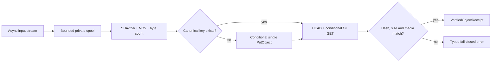

# Content-Addressable Object Storage Design

**Status:** Approved design target for Phase 1 implementation planning

**Scope owner:** Canonical-byte storage contracts and the Cloudflare R2 S3 adapter

**Depends on:** `phase-one-workspace-bootstrap-design.md`, `runtime-configuration-and-diagnostics-design.md`, `canonical-postgresql-baseline-design.md`

**Followed by:** `source-version-commit-and-idempotency-design.md`, `canonical-core-acceptance-and-recovery-design.md`

## 1. Objective

Store exact source bytes once in a private Cloudflare R2 bucket under an immutable SHA-256-derived key, and expose them to a caller only after independent size, media-type and full-content verification.

This design creates the object-storage half of the canonical boundary. R2 owns canonical bytes; PostgreSQL owns canonical metadata and references. The adapter returns an internal verified receipt but does not write `knowledge.content_objects`, publish a source version or advance a source pointer. Those database behaviors belong to the next design.

Safety and bounded resource use have equal priority. A malformed client claim, interrupted upload, concurrent duplicate, lost R2 response, missing object or corrupted object must produce either a reusable verified object or a typed fail-closed error. It must never produce a PostgreSQL reference to bytes that the backend has not independently verified.

## 2. Scope

### 2.1 In scope

- Provider-neutral asynchronous canonical-object contracts under `personal_os`.
- One concrete Cloudflare R2 implementation using the S3-compatible API.
- Exact SHA-256 key derivation and immutable object metadata.
- Bounded local spooling while hashing an asynchronous input stream.
- Single-part conditional upload for objects from zero through 100 MiB.
- `Content-MD5` transport checking plus application-owned full SHA-256 verification.
- Deduplication, same-key concurrency and lost-response recovery.
- Full verification of an existing R2 object before issuing an internal receipt.
- Fail-closed reads that expose no bytes before verification finishes.
- Object-storage configuration, secret-file composition, typed errors, structured diagnostics and bounded retry.
- Offline unit/contract tests and a separate live R2 test-bucket pipeline.
- A future-safe `verify_existing_object()` seam for bytes written through an approved upload path.

### 2.2 Out of scope

- PostgreSQL inserts, repositories, transactions or source current-pointer changes.
- FastAPI routes, MCP tools, Web App upload behavior or an Obsidian sync protocol.
- Cloudflare Workers, upload routing modes or a file-size routing threshold.
- Presigned URLs, temporary credentials or direct client-to-R2 upload.
- Multipart, resumable or ranged upload.
- Ranged reads or unverified pass-through streaming to consumers.
- MinIO, another S3 implementation, multi-provider selection, fallback, dual-write or cutover.
- Object deletion, listing, copy, mutation, lifecycle expiration or garbage collection.
- Client-side encryption, SSE-C or customer-managed encryption keys.
- Backup, restore and cross-failure-domain replication.
- Mutation testing and a hard throughput SLA.

Phase 1 has one effective size limit: every accepted object is between `0` and `104_857_600` bytes inclusive and travels through the server adapter. A future Worker design may choose a routing threshold within that range, but no threshold other than the 100 MiB maximum is a contract of this spec.

## 3. Selected approach

Use a **verified-spool content-addressable store**:

1. Validate declared size and normalized media type.
2. Reserve bounded spool capacity.
3. Receive the complete stream into a private local spool while calculating SHA-256, MD5 and exact byte count.
4. Reject any mismatch before contacting R2.
5. Derive the canonical key from the backend-calculated SHA-256.
6. Resolve and fully verify an existing object, or conditionally create it with a single `PutObject`.
7. Read the stored object back under an ETag precondition and independently recalculate SHA-256 and size.
8. Return an immutable `VerifiedObjectReceipt` only after every check succeeds.
9. Delete the spool in all success, failure and cancellation paths.



The extra R2 read after upload is deliberate. A successful SDK call, ETag, client-supplied digest or provider metadata alone does not establish canonical SHA-256 integrity. Full verification is the condition for creating a receipt.

### 3.1 Alternatives rejected

1. **Buffer the complete object in memory.** Four concurrent 100 MiB objects would create unsafe and unpredictable process pressure.
2. **Stream directly from the client into R2.** The canonical key is unknown until the backend hashes the complete stream, and a non-rewindable stream cannot safely retry.
3. **Trust a client hash and upload directly to the final key.** Client claims are hints, not authority; buggy or malicious clients could bind the wrong bytes to canonical state.
4. **Use an R2 staging prefix then server-side copy.** It adds mutable temporary objects, cleanup races and a second object operation without removing the need for independent verification.
5. **Treat `HEAD`, ETag or provider checksum as proof.** They do not replace the application-owned exact-byte SHA-256 contract.
6. **Expose bytes while calculating their hash.** A consumer could parse or project corrupted bytes before a mismatch becomes known.
7. **Use MinIO or an S3 emulator for local correctness.** It introduces a second behavior contract that does not prove Cloudflare compatibility. Offline tests use a scripted transport; compatibility tests use R2.
8. **Delete an upload when the later PostgreSQL transaction fails.** The object may have pre-existed or may be in use by a concurrent transaction.

## 4. Package and dependency boundaries

### 4.1 Repository layout

```text
src/personal_os/object_storage/
├── __init__.py
├── contracts.py
├── errors.py
└── keys.py
packages/r2-object-storage/
├── pyproject.toml
└── src/r2_object_storage/
    ├── __init__.py
    ├── adapter.py
    ├── error_mapping.py
    ├── runtime_check.py
    ├── settings.py
    └── spool.py
tests/
├── unit/object_storage/
├── contract/object_storage/
└── integration/r2_object_storage/
```

`packages/r2-object-storage` is a concrete `uv` workspace member and distribution. Its import package is `r2_object_storage`; the semantic distribution name and Python import name follow repository naming rules.

Dependency direction is exactly:

```text
r2_object_storage -> personal_os.object_storage
```

`personal_os` does not import `r2_object_storage`, `aiobotocore`, `botocore`, `aiohttp` or another infrastructure SDK. The R2 package may import the shared runtime-configuration, error and diagnostics contracts from `personal_os`, but the core package cannot import back into the adapter. Composition roots select and construct the concrete adapter later.

The import-linter and static architecture tests add `r2_object_storage` as an infrastructure root and explicitly forbid `personal_os` from importing it or `aiobotocore`.

### 4.2 Exact dependencies

Versions were rechecked on 2026-08-14:

| Package | Version | Scope | Purpose |
|---|---:|---|---|
| `aiobotocore` | `3.9.0` | production | Async S3 client and streaming response support |
| `types-aiobotocore[s3]` | `3.9.0` | development | Strict S3 client/request/response typing |

`aiobotocore` is the only direct production SDK dependency of the R2 member. Its compatible `botocore`, `aiohttp` and related dependencies are resolved and locked exactly in `uv.lock`; they are not separately imported by the domain package. Do not add `boto3`, `minio`, `aiofiles` or an automatic S3 transfer manager.

Local file operations use the Python standard library through bounded `asyncio.to_thread` calls. The implementation must not create an unbounded executor or one thread per object.

## 5. Domain value objects and port

All types in this section are transport-neutral, fully typed, immutable and free of provider response types.

### 5.1 `ContentDigest`

```text
ContentDigest
  algorithm: fixed "sha256"
  hexadecimal: exactly 64 lowercase hexadecimal characters
```

Uppercase, prefixes such as `sha256:`, surrounding whitespace and non-hexadecimal values are rejected. Conversion from raw digest bytes is allowed only through a validating constructor.

### 5.2 `CanonicalObjectKey`

The only valid key function is:

```text
objects/sha256/{digest[0:2]}/{digest[2:4]}/{digest}
```

Examples:

```text
sha256  0123456789abcdef...64 characters
key     objects/sha256/01/23/0123456789abcdef...64 characters
```

The key has no workspace, source, filename, path, date, environment, test-run or media-type component. Callers cannot supply an arbitrary key. Parsing a key recalculates and validates every segment; path traversal, repeated separators, percent encoding and alternate prefixes are invalid.

### 5.3 Media type

Canonical media type is a lowercase ASCII `type/subtype` with exactly one slash and MIME-token characters only. Parameters such as `; charset=utf-8`, whitespace, control characters, wildcard values and an empty type/subtype are rejected. A caller that has no more specific trusted classification uses `application/octet-stream`.

Media type is metadata, not part of the digest or key. Because the PostgreSQL baseline stores one globally deduplicated row per hash, the same hash with a different normalized media type is a metadata conflict rather than silent first-writer-wins.

### 5.4 Expected object and verified receipt

```text
ExpectedObject
  content_digest: ContentDigest
  size_bytes: int
  media_type: CanonicalMediaType

VerifiedObjectReceipt
  content_digest: ContentDigest
  object_key: CanonicalObjectKey
  size_bytes: int
  media_type: CanonicalMediaType
  verified_at: aware UTC datetime
  verification_method: uploaded_full_read | existing_full_read
```

`ExpectedObject` is a verification request, not proof. `VerifiedObjectReceipt` is an internal application value returned only by this adapter after a complete verification. It is never deserialized from HTTP, MCP, Worker, Web App or Obsidian input and is not stored as an upload-session row.

The receipt deliberately contains no bucket, endpoint, ETag, credential, spool path or provider response. Provider ETag remains an adapter-local concurrency token.

### 5.5 Asynchronous port

```text
CanonicalObjectStore
  async resolve_verified_object(expected: ExpectedObject)
    -> VerifiedObjectReceipt | None

  async store_stream(
    stream: AsyncIterable[bytes],
    expected_size_bytes: int,
    media_type: str,
    claimed_sha256: str | None = None,
  ) -> VerifiedObjectReceipt

  async verify_existing_object(expected: ExpectedObject)
    -> VerifiedObjectReceipt

  open_verified_reader(expected: ExpectedObject)
    -> AsyncContextManager[VerifiedObjectReader]
```

`VerifiedObjectReader` exposes bounded asynchronous reads from an already verified local spool. It does not expose a filesystem path, file descriptor or R2 response object.

`resolve_verified_object()` returns `None` only when the canonical key does not exist. An object at that key with conflicting metadata or bytes raises a typed error. `verify_existing_object()` and `open_verified_reader()` treat absence as an error because their caller expects the object to exist.

The port exposes no delete, list, overwrite, copy, rename, URL or provider selection operation.

## 6. Upload and deduplication contract

### 6.1 Input admission

Before reading the stream:

- `expected_size_bytes` must be an integer from `0` through `104_857_600` inclusive; booleans are not integers for this contract.
- `media_type` must normalize to the canonical grammar in section 5.3.
- `claimed_sha256`, when present, must be a valid `ContentDigest`.
- The spool manager must reserve the declared size while preserving the process and filesystem safety margins.
- The operation receives one of four process-wide in-flight permits.

The backend does not select the final key from `claimed_sha256`. It reads the stream completely and calculates its own digest. A claim can reject a mismatch early in the R2 phase and can support a later API preflight, but it never substitutes for receiving and hashing the exact bytes committed by this operation.

### 6.2 Spooling and hashing

- Read at most 1 MiB from the input per chunk.
- Every yielded value must be non-empty `bytes`; non-bytes values and pathological empty-chunk loops are invalid streams.
- Write each chunk to the reserved spool while updating SHA-256, MD5 and byte count.
- If byte count exceeds `expected_size_bytes`, stop immediately. At most one input chunk beyond the declaration may have been accepted into memory; it is never written beyond the configured maximum.
- If end-of-stream occurs below the declaration, reject it as a size mismatch.
- If the backend digest differs from `claimed_sha256`, reject it as a digest mismatch.
- Rewind and inspect the spool as a regular file before any R2 call.

MD5 is used only as the S3 `Content-MD5` transport guard. It is not an identity, key or canonical integrity algorithm. SHA-256 remains the sole content identity.

### 6.3 Existing-object preflight

After calculating the canonical digest and key, call `HeadObject` for that exact key:

- Missing means the adapter may attempt a conditional create.
- Matching size and media type lead to a conditional full `GetObject` verification.
- A size mismatch is `object_storage_integrity_failed`.
- A media-type mismatch is `object_storage_metadata_conflict`.
- An invalid or incomplete provider response is `object_storage_contract_invalid`.

`HeadObject` never creates a receipt by itself. A matching existing object is deduplicated only after full SHA-256 verification.

### 6.4 Conditional create

The low-level request is one `PutObject` with:

```text
Bucket          configured private bucket
Key             backend-derived canonical key
Body            rewindable spool
ContentLength   exact verified spool size
ContentType     canonical media type
ContentMD5      base64-encoded binary MD5 digest
IfNoneMatch     *
```

The adapter must call `put_object` directly. It must not use `upload_fileobj`, a transfer manager or any API that can silently select multipart upload.

Outcomes:

- Success leads to full stored-object verification.
- HTTP `412 PreconditionFailed` means another writer won the immutable-key race; verify that winner.
- A lost or ambiguous response does not cause a blind second PUT. The next retry begins with `HeadObject`; an existing valid object resolves the operation.
- `BadDigest`/`InvalidDigest` is terminal for the attempt and cannot create a receipt.
- A conflicting or corrupted object is never overwritten or deleted in self-repair.

R2 S3 operations are strongly consistent, so a successful conditional create can be resolved immediately through `HEAD`/`GET`; no sleep or eventual-consistency polling loop is allowed.

### 6.5 Same-process single flight

The adapter maintains a bounded per-process single-flight table keyed by `ContentDigest`. Concurrent operations for the same digest share the R2 resolve/create/verify work after each has independently validated its own input stream. Cancellation by one waiter does not cancel the shared owner while other waiters remain.

Entries are removed after the operation completes. This table is not a verification cache and cannot grow with lifetime object count. Cross-process concurrency is resolved only by conditional create plus winner verification.

There is no long-lived “already verified” cache. Reusing an existing object for a new canonical commit requires current full verification. A future reconciliation scan may use an explicit sampling policy, but it cannot reinterpret a historical receipt as current proof.

## 7. Stored-object verification

Verification is the same for a newly uploaded object, a deduplication hit and a future approved external upload:

1. `HeadObject` the exact canonical key.
2. Require exact `ContentLength` and normalized `ContentType`.
3. Capture the returned ETag as an opaque adapter-local token.
4. `GetObject` the complete object with `If-Match: <etag>`.
5. Stream the response into a new bounded verification spool, calculating SHA-256 and byte count.
6. Stop immediately if the response exceeds expected size.
7. Require exact end-of-stream size and digest.
8. Close the response body before returning or raising.
9. Create a receipt with an adapter-owned UTC verification timestamp.

No range request is used. The verification spool is distinct from an upload spool so the adapter proves the stored response rather than accidentally re-verifying its local input.

If the ETag changes between `HEAD` and `GET`, the conditional GET fails. Because canonical keys are immutable, the adapter fails closed rather than following a moving value. A missing object after a successful `HEAD`, changing ETag, excess bytes, short body or digest mismatch is an integrity failure.

An object of size zero is valid. It still has the SHA-256 of empty bytes, an exact media type and a complete verification cycle.

## 8. Fail-closed read contract

`open_verified_reader(expected)` performs the full process in section 7 before its context manager yields a reader. The consumer receives no object byte while R2 verification is in progress.

After verification:

- Reads come only from the verified local spool.
- The reader supports bounded sequential reads and asynchronous iteration with chunks no larger than 1 MiB.
- Seeking, arbitrary range reads and access to the underlying path are unsupported.
- Exiting the context closes and removes the spool.
- End-of-stream, explicit close, exception and cancellation are idempotent cleanup paths.
- Use after context exit raises a safe local contract error.

Each retry of a failed R2 read uses a fresh empty verification spool and restarts from byte zero. Partial output is never reused and never reaches the consumer.

This design intentionally trades one full-object spool and complete R2 read for a strict trust boundary. Cached verification or verified pass-through streaming requires a later design with explicit freshness, revocation and partial-consumption semantics.

## 9. Spool and resource safety

### 9.1 Fixed Phase 1 limits

| Limit | Value |
|---|---:|
| Maximum object size | `100 MiB` (`104_857_600` bytes) |
| Stream/read chunk | `1 MiB` (`1_048_576` bytes) |
| In-flight object operations per process | `4` |
| Reserved spool bytes per process | `512 MiB` |
| Filesystem free-space reserve after admission | `2 GiB` |
| Input receive deadline | `10 minutes` |
| One logical R2 operation deadline | `5 minutes` |
| Stale spool age | `24 hours` |

These are security and capacity constants, not environment settings. An operator cannot weaken them through environment variables. A later measured capacity change requires a reviewed contract and boundary tests.

The reservation manager accounts for upload and verification spools. It rejects admission with `object_storage_busy` before reading content if the per-process budget or filesystem reserve cannot be maintained. Reservation release is idempotent.

The 512 MiB process budget allows four maximum-sized input spools with headroom, but post-upload verification can require a second spool. Verification therefore has its own reservation and admission point; operations wait before starting GET when that reservation is unavailable. At most one maximum-sized verification spool can coexist with four retained maximum-sized input spools (`500 MiB` total). No implementation path may assume all four operations can verify concurrently or exceed the declared budget.

The budget is process-local. A multi-process deployment must size a dedicated encrypted/ephemeral spool volume for the aggregate replica count and retain the 2 GiB filesystem reserve. Phase 1 does not introduce a cross-process reservation daemon.

### 9.2 Filesystem behavior

- `spool_root` is an absolute existing directory resolved at startup.
- Spool files are direct children with an internal random name such as `cas-spool-<uuid>.part`; names contain no digest, source ID or user filename.
- Files are created exclusively and opened without following a final symlink where the platform supports it.
- The opened descriptor is checked to be a regular file.
- POSIX mode is owner read/write only; the process umask cannot broaden it.
- The resolved file remains beneath the resolved spool root.
- Spools are never included in logs, exception details or CI artifacts.

The deployment must place the spool on an encrypted filesystem or an ephemeral encrypted volume. Deletion is ordinary filesystem unlink, not a claim of cryptographic secure erase.

### 9.3 Startup janitor

Startup performs a bounded, non-recursive cleanup of direct child files that:

- match the exact internal spool filename grammar;
- are regular files and not symlinks;
- are older than 24 hours;
- remain beneath the resolved spool root.

It never follows a wildcard outside the root, never recursively deletes and never touches an unknown filename. One startup examines/deletes at most 1,000 candidates; remaining candidates emit `object_storage_spool_cleanup_degraded` and are handled by a later run. A cleanup failure does not disclose a path and does not block unrelated reads, but new writes remain subject to free-space admission.

## 10. Configuration and client lifecycle

### 10.1 Settings schema

The adapter owns one frozen `ObjectStorageSettings` snapshot:

```text
ObjectStorageSettings
  environment: RuntimeEnvironment
  secret_root: absolute Path
  r2_endpoint: validated HTTPS URL
  r2_bucket_name: validated bucket name
  r2_access_key_id_file: relative secret filename
  r2_secret_access_key_file: relative secret filename
  object_storage_spool_root: absolute Path
```

Approved environment variables are exactly:

```text
KNOWLEDGE_ENVIRONMENT
KNOWLEDGE_SECRET_ROOT
KNOWLEDGE_R2_ENDPOINT
KNOWLEDGE_R2_BUCKET_NAME
KNOWLEDGE_R2_ACCESS_KEY_ID_FILE
KNOWLEDGE_R2_SECRET_ACCESS_KEY_FILE
KNOWLEDGE_OBJECT_STORAGE_SPOOL_ROOT
```

There is no `.env`, ambient AWS credential chain, shared AWS credentials file, EC2/container metadata lookup, CLI secret, plaintext secret environment variable or provider fallback.

The endpoint must be exactly `https://<account-id>.r2.cloudflarestorage.com` with no username, password, port, path, query or fragment. HTTP and custom S3 endpoints are rejected. Region is fixed to `auto`; TLS verification cannot be disabled.

Bucket names are lowercase R2-compatible names from 3 through 63 characters. Production and test names are supplied explicitly; the adapter never creates or discovers a bucket.

Both credential settings are single relative filenames resolved beneath `secret_root` through the existing bounded secret-file loader. A separator, absolute path, `.` or `..` is invalid. Secret values become plaintext only while constructing the SDK client and never enter a model representation or diagnostic payload.

### 10.2 Known environment-name registry

The existing runtime contract is refined so each adopted settings fragment has:

- an **owned key set**, which it parses; and
- a repository-wide **known `KNOWLEDGE_*` key registry**, which prevents typos without making every loader parse every subsystem.

An object-storage loader ignores registered database/service keys it does not own, but an unregistered `KNOWLEDGE_*` name remains terminal `configuration_unknown_key`. This avoids false failures when a composition root combines runtime, database and object-storage configuration while preserving strict typo detection. The registry stores names only, never values.

### 10.3 SDK client configuration

One adapter instance lazily creates and reuses one async S3 client per process. It closes that client explicitly during composition-root shutdown.

Required client behavior:

```text
service                 s3
region                  auto
signature               SigV4
maximum connections     4
connect timeout         5 seconds
socket/read timeout     60 seconds
SDK automatic retries   disabled
TLS verification        enabled
credential discovery    disabled
```

The adapter owns retries so attempt count, overall deadline, error mapping and diagnostics remain deterministic. Client construction is concurrency-safe; a cancelled initializer cannot publish a partial client.

## 11. Retry and concurrency behavior

One logical R2 operation permits at most three total attempts within its five-minute deadline. Backoff is exponential with bounded full jitter. The deadline, not the attempt count, wins.

Retryable conditions:

- connection establishment failure;
- connection reset or safe socket interruption before completion;
- HTTP `408`, `429`, `500`, `502`, `503` or `504`;
- R2 `SlowDown` or an equivalent registered throttling code.

Non-retryable conditions:

- `BadDigest` or `InvalidDigest`;
- authentication/authorization failure;
- `NoSuchBucket`;
- canonical object missing when existence is required;
- content, size or metadata mismatch;
- malformed provider response;
- unsupported non-transient `4xx` response.

`412 PreconditionFailed` during conditional create is neither a normal retry nor an integrity failure; it transitions directly to winner verification.

Every retry after an ambiguous PUT begins with `HeadObject`. If the object now exists, the adapter verifies it instead of sending another PUT. Every retry of GET starts a clean spool. The adapter contains no circuit breaker and no hidden queue; admission control above the port and later Temporal/sync workflows own longer-lived retry scheduling.

Cancellation:

- stops accepting input;
- closes R2 response/client contexts owned by the operation;
- performs shielded, bounded local cleanup;
- releases permits and spool reservations exactly once;
- re-raises cancellation instead of mapping it to a dependency error.

## 12. Error contract

Add these stable entries to the shared error registry:

| Error code | Category | Retryable | Safe meaning |
|---|---|---:|---|
| `object_storage_configuration_invalid` | configuration | false | Object-storage configuration is invalid |
| `object_storage_input_invalid` | validation | false | Object-storage input is invalid |
| `object_storage_busy` | dependency | true | Local object-storage capacity is temporarily unavailable |
| `object_storage_unavailable` | dependency | true | Canonical object storage is temporarily unavailable |
| `object_storage_access_denied` | authorization | false | Canonical object storage denied access |
| `object_storage_contract_invalid` | integrity | false | Object-store response violated the adapter contract |
| `object_storage_object_missing` | integrity | false | An expected canonical object is missing |
| `object_storage_integrity_failed` | integrity | false | Canonical object integrity verification failed |
| `object_storage_metadata_conflict` | conflict | false | Existing canonical object metadata conflicts with expected metadata |

Allowed safe reason tokens for `object_storage_input_invalid` are:

```text
size_out_of_range
size_mismatch
digest_mismatch
media_type_invalid
stream_invalid
```

Provider exception classes, response bodies, request IDs, headers and messages remain chained only as internal causes. They are never copied into `safe_message`, `safe_details`, `str(error)` or diagnostics. Error mapping is exhaustive for known S3/R2 failures; an unknown exception crosses the composition boundary as `internal_error` after safe cleanup.

`resolve_verified_object()` uses `None` for an ordinary absence probe. Other methods map absence to `object_storage_object_missing`; callers do not need to parse provider codes.

## 13. Diagnostics and privacy

Register these events:

| Event | Normal level/result | Purpose |
|---|---|---|
| `object_storage_operation_succeeded` | info/succeeded | A store, verify or read operation completed |
| `object_storage_operation_failed` | warning or error/failed | A typed operation failure crossed the adapter boundary |
| `object_storage_object_deduplicated` | info/succeeded | An existing object was fully verified and reused |
| `object_storage_integrity_failed` | error/failed | Stored bytes or immutable metadata failed verification |
| `object_storage_spool_cleanup_degraded` | warning/degraded | Bounded stale-spool cleanup could not finish |

Allowed fields are registered, bounded and low sensitivity:

```text
operation
duration_ms
size_bytes
attempt_count
provider            fixed r2
error_code
error_category
is_retryable
object_digest_prefix  first 12 lowercase hex, logs only when needed
count
```

Never log or attach:

- raw bytes or content fragments;
- full digest or object key;
- bucket name or endpoint;
- media type, source locator, filename or local path;
- access key, secret or secret filename;
- signed URL, request/response header or response body;
- provider request ID or raw exception text;
- complete environment or settings dump.

Metrics may use operation, result/error code and provider labels. Digest prefix is forbidden as a metric label. Required counters/gauges/histograms cover operations, dedup hits, integrity failures, bytes, latency, retries, in-flight operations, reserved spool bytes and cleanup failures.

Correlation uses the already bound request/trace context. The adapter never generates a replacement request ID inside a normal application operation; the standalone runtime check establishes its own safe operation context.

## 14. Security and operational behavior

### 14.1 Bucket and credential isolation

- Production and test/CI use different private buckets and different credentials.
- Each R2 token has Object Read & Write permission scoped only to its exact bucket.
- Production credentials never enter CI; test credentials never enter production.
- Public development URL and custom public domain are disabled.
- Canonical objects have no automatic expiration rule.
- Credentials are loaded from secret files and rotation takes effect on process restart.

R2 groups write and delete capability in its object-write permission. Application defense therefore includes the absence of any delete operation from the production port and adapter. Test cleanup uses a separate harness-only low-level operation constrained as described in section 16.

### 14.2 Startup, liveness and readiness

- Startup validates settings, secret files and spool safety without calling R2.
- Liveness never calls R2.
- Normal readiness does not make a network call that would cause an orchestrator to restart healthy application processes during an R2 incident.
- The explicit object-storage runtime check calls read-only `HeadBucket` with bounded timeout/retry and reports ready or degraded through typed diagnostics.
- The runtime check never writes, lists or deletes an object.

An R2 outage degrades operations that require canonical bytes. It does not trigger provider switching, Worker routing or process restart loops, and it does not prevent unrelated local diagnostics from running.

## 15. PostgreSQL transaction and crash boundary

R2 upload/verification and PostgreSQL publication are intentionally separate steps:

```text
store or resolve bytes
  -> VerifiedObjectReceipt
  -> later PostgreSQL source-version transaction
```

The next design may create or reuse `knowledge.content_objects` only from a current receipt. It must never construct database values directly from a client claim, `HEAD`, key string or upload response.

Failure outcomes:

| Failure point | Required state |
|---|---|
| Before upload completes | No receipt; no PostgreSQL publication |
| R2 write succeeds but verification fails | No receipt; no PostgreSQL publication |
| Verification succeeds, process crashes before database commit | Unreferenced R2 object may remain |
| Database commit succeeds, response is lost | Next design resolves replay through idempotency |
| Referenced object later becomes missing/corrupt | Every subsequent read fails closed |

An unreferenced object is safe but may consume storage. A later retry can reuse it only after fresh verification. The adapter does not compensate a failed database transaction by deleting the object because it may pre-exist or a concurrent transaction may be about to reference it.

Future garbage collection requires a database-reference check, a conservative age grace period, a second reference check immediately before deletion, audit and dry-run. It is not implemented here.

The integrity guarantee assumes approved writers follow the immutable adapter/Worker contract. Compromised R2 credentials can overwrite a key outside the application. Fail-closed reads detect that violation but cannot prevent it; credential isolation, rotation and recovery controls remain mandatory.

## 16. Test strategy

### 16.1 Offline unit and contract suite

The default `poe verify` path requires no R2 credentials or network. Tests cover:

- digest and canonical-key construction/parsing;
- media-type grammar;
- zero, one and multi-chunk streams;
- exact 100 MiB boundary and one-byte overflow;
- short stream, long stream, invalid chunk and claimed-digest mismatch;
- SHA-256 and `Content-MD5` request construction;
- spool admission, backpressure, cleanup and 24-hour janitor boundary;
- symlink/non-regular-file and path-containment rejection;
- conditional PUT and `412` winner verification;
- same-process single flight and cross-writer scripted races;
- lost PUT response resolved through `HEAD` plus verification;
- retryable/non-retryable error matrix and deadline exhaustion;
- full verification for new and existing objects;
- missing, excess, short, changed-ETag, corrupted and metadata-conflict cases;
- no consumer bytes before read verification completes;
- cleanup under success, typed failure, unexpected exception and cancellation;
- client reuse and explicit shutdown;
- settings-source, secret and ambient-credential rejection;
- diagnostic allowlists and forbidden-data leakage sentinels;
- architecture boundaries and complete typing.

Use a scripted async S3 transport or `AioStubber` at the SDK boundary. Tests must assert requests and behavior, not reproduce provider implementation. No MinIO, LocalStack or generic S3 emulator is added.

A deterministic 10,000-item offline workload proves that:

- no more than four object operations are in flight;
- spool reservation never exceeds 512 MiB;
- memory/spool state does not grow with completed item count;
- same-hash inputs converge;
- backpressure, cancellation and retry leave no leaked reservation.

It is a bounded-behavior test, not a wall-clock benchmark.

### 16.2 Live R2 pipeline

Add a separate command such as:

```text
uv run poe object-storage-test-live
```

The live job:

- runs only on a trusted protected branch, schedule or manual dispatch;
- receives credentials for one dedicated private test bucket;
- never receives production bucket information or credentials;
- fails clearly when explicitly invoked without required configuration rather than skipping;
- has a finite job timeout and always attempts exact cleanup;
- uploads only generated non-personal payloads;
- emits only sanitized JUnit/diagnostic artifacts.

Live cases are:

1. zero-byte store, verify and read;
2. ordinary multi-chunk store, verify and read;
3. duplicate store;
4. concurrent conditional create;
5. missing expected object;
6. size and media conflict;
7. intentionally corrupted object detected by full verification;
8. repeated/lost-response-equivalent resolution;
9. exact cleanup after success and test failure.

Boundary size 100 MiB, timeout injection, retry matrix and cancellation remain offline tests to avoid unnecessary cost and nondeterminism. Multipart and presigned behavior are not tested because Phase 1 does not implement them.

### 16.3 Exact-key cleanup

CAS test objects must retain the production key grammar. They cannot be placed under `test-runs/<run-id>/...` without violating the key contract.

For each run, the harness records an in-memory/on-runner allowlist of every exact canonical key that it created. Cleanup may delete only when all are true:

- the configured bucket is the dedicated test bucket;
- the key is present in the current run's allowlist;
- the key parses as an exact canonical SHA-256 key;
- the payload was generated for this run.

The cleanup harness does not call `ListObjects`, delete a prefix or use a wildcard. Cleanup failure fails the live job and reports only shortened digest prefixes. The harness-only delete client is outside the production adapter/package exports and is covered by static import checks.

The canonical testing plan, implementation plan, glossary and earlier local-stack design are updated from “exact run-prefix cleanup” to “exact per-run canonical-key allowlist.”

## 17. Future Worker compatibility

`verify_existing_object(expected)` is the only Phase 1 seam reserved for a future optional Cloudflare Worker upload path. Future behavior must preserve this order:

```text
client obtains an approved upload plan
  -> selected route writes the same canonical R2 key
  -> backend independently verifies the stored object
  -> backend issues VerifiedObjectReceipt
  -> PostgreSQL transaction publishes the version
```

A Worker is an upload accelerator for the same R2 store, not a second provider, fallback authority or source of truth. A future `server_only`/`hybrid_edge` toggle applies only to newly issued upload plans; it must not switch an in-flight request. Capabilities expire and carry a routing revision.

No Worker source, deployment, public endpoint, toggle, `UploadPlan`, route threshold or multipart behavior is delivered by this spec. The previously discussed 8 MiB value is not a Phase 1 requirement and must be re-evaluated from telemetry in its owning design.

## 18. Acceptance criteria

1. The only accepted object key is `objects/sha256/{first_2}/{next_2}/{sha256}` derived from backend-calculated exact bytes.
2. Objects from zero through 100 MiB are processed with bounded chunks and without loading the complete body into memory.
3. Object, process spool, concurrency, free-space and phase deadlines are enforced under success and failure.
4. Client-declared size, hash and media values cannot independently create a receipt or PostgreSQL-ready reference.
5. Upload uses one conditional single-part `PutObject`; no automatic multipart or overwrite path exists.
6. A newly uploaded object is full-read and independently verified before a receipt is returned.
7. An existing same-hash object is full-read before deduplication succeeds.
8. Concurrent same-hash uploads converge through conditional create and winner verification.
9. A lost PUT response is safely resolved without blind overwrite.
10. Missing, corrupt, truncated, oversized, changing or metadata-conflicting objects fail closed with stable typed errors.
11. `open_verified_reader()` exposes no byte before complete verification and always removes its spool.
12. Cancellation and every exception path close streams, release permits/reservations and preserve the original cancellation semantics.
13. The provider SDK exists only in the concrete R2 package; `personal_os` remains infrastructure-independent.
14. Configuration uses only approved `KNOWLEDGE_*` names and bounded secret files; ambient AWS configuration is ineffective.
15. Logs, metrics, CLI output and CI artifacts contain no content, full digest/key, bucket/endpoint, path, credential or raw provider error.
16. Production code exposes no object delete, list, overwrite, copy, public URL or presigned operation.
17. A deterministic 10,000-item offline workload remains within four operations and the 512 MiB spool budget.
18. Offline unit/contract tests pass without network access.
19. The trusted live pipeline passes against the dedicated R2 test bucket and cleans only the current run's exact-key allowlist.
20. Ruff, mypy strict, import boundaries, pytest, builds and existing repository gates pass on the same implementation commit.

## 19. Expected implementation deliverables

```text
src/personal_os/object_storage/
packages/r2-object-storage/
tests/unit/object_storage/
tests/contract/object_storage/
tests/integration/r2_object_storage/
docs/operations/object-storage.md
.github/workflows/object-storage-live.yml
pyproject.toml
uv.lock
.importlinter
```

Implementation also updates the diagnostics error/event registries, repository-wide known environment-name registry, type-check/build paths, Poe commands and exact canonical documentation identified in section 16.3. It does not add an upload API, database repository, Worker, MinIO service or garbage collector.

## 20. Primary references

- [Cloudflare R2 S3-compatible API](https://developers.cloudflare.com/r2/api/s3/api/)
- [Cloudflare R2 S3 credentials and endpoint](https://developers.cloudflare.com/r2/get-started/s3/)
- [Cloudflare R2 consistency model](https://developers.cloudflare.com/r2/reference/consistency/)
- [Cloudflare R2 error codes](https://developers.cloudflare.com/r2/api/error-codes/)
- [Cloudflare R2 Workers API reference](https://developers.cloudflare.com/r2/api/workers/workers-api-reference/)
- [aiobotocore 3.9.0 release](https://pypi.org/project/aiobotocore/)
- [types-aiobotocore 3.9.0 release](https://pypi.org/project/types-aiobotocore/)
